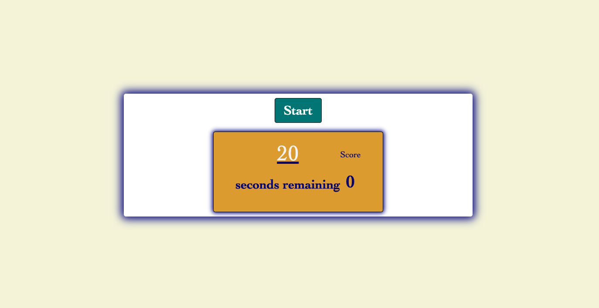

# code-quiz-homework

This was the hardest project i have worked on. I was trying to make a quiz game but I just couldn't figure out how to deduct time for wrong answers and set up local storage. The quiz was supposed to save highscores and deduct time off any wrong aswers. 

[Quiz Web App](https://deanmahaffey.github.io/code-quiz-homework/)

